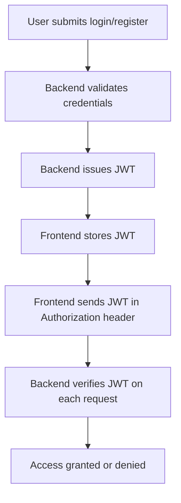

# TenderConnect Architecture Overview

## 1. API Design

- **RESTful API** using Express.js (Node.js)
- **Endpoints** are grouped by resource:
  - `/auth` — Authentication (register, login, profile)
  - `/companies` — Company CRUD
  - `/tenders` — Tender CRUD
  - `/applications` — Applications to tenders
  - `/search` — Search/filter endpoints for companies, tenders, industries, services
- **Request/Response**: JSON format
- **Pagination**: Supported on list endpoints (e.g., `/search/companies`)
- **Error Handling**: Consistent error structure `{ error, details }`

## 2. Authentication Flow

- **JWT-based authentication**
  - On login/register, backend issues a JWT (access token)
  - Token is stored in browser localStorage (frontend)
  - All protected API requests include `Authorization: Bearer <token>` header
- **Middleware**
  - Express middleware checks JWT on protected routes
  - User info is attached to `req.user` if valid
- **Roles**
  - Users have roles (e.g., `user`, `admin`)
  - Role-based access enforced in middleware and route handlers

**Flow Diagram:**

## 3. Storage Integration

- **Database**: PostgreSQL (via Supabase or direct connection)
  - Tables: `users`, `companies`, `goods_services`, `tenders`, `applications`
  - Managed via Knex.js migrations
- **File Storage**: Supabase Storage (for company logos, etc.)
  - Images uploaded to Supabase bucket
  - URLs stored in `companies.logo_url`
- **Environment Variables**
  - DB connection string, JWT secret, Supabase keys, etc. managed via `.env` files

## 4. Frontend-Backend Integration

- **API calls** from Next.js frontend to backend using `fetch`/`apiFetch`
- **Environment variable** `NEXT_PUBLIC_API_BASE` controls API base URL
- **SSR/CSR**: Next.js supports both, but most data fetching is client-side for authenticated routes

---

**Summary:**
TenderConnect uses a modular REST API, JWT authentication, PostgreSQL for relational data, and Supabase for file storage. The architecture is designed for scalability, security, and ease of integration with modern frontend frameworks. 